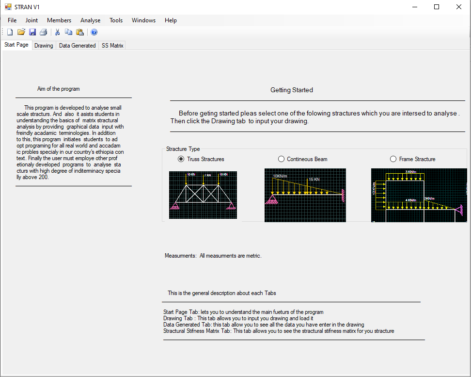

# STRAP
I developed this program during the 3rd-year of my undergraduate study using C\#. The program is developed to analyze small-scale 2D structures like beam, truss and plane frames. It uses the matrix method to solve for the member forces. The analysis procedure is very interactive and provide graphical data input with friendly academic terminologies. 

You can download the Windows instalation file from `Excutable/STRAPV1.msi` 
